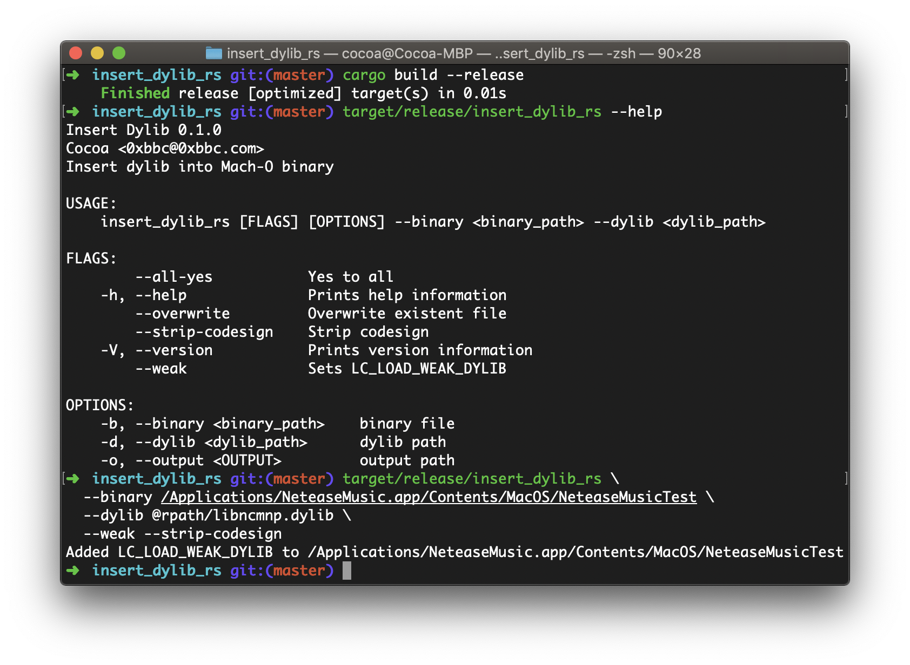

# insert_dylib_rs
Rewrite insert_dylib in Rust

### Usage

```bash
cargo build --release

# for help info
target/release/insert_dylib_rs --help

# example
target/release/insert_dylib_rs \
    --binary /Applications/NeteaseMusic.app/Contents/MacOS/NeteaseMusicTest \
    --dylib @rpath/libncmnp.dylib \
    --weak --strip-codesign
```

There are some details in my [blog post](https://blog.0xbbc.com/2020/02/rust-learning-from-zero-19/).

Thanks for all the work from original author [Tyilo/insert_dylib](https://github.com/Tyilo/insert_dylib).

### Screenshot

